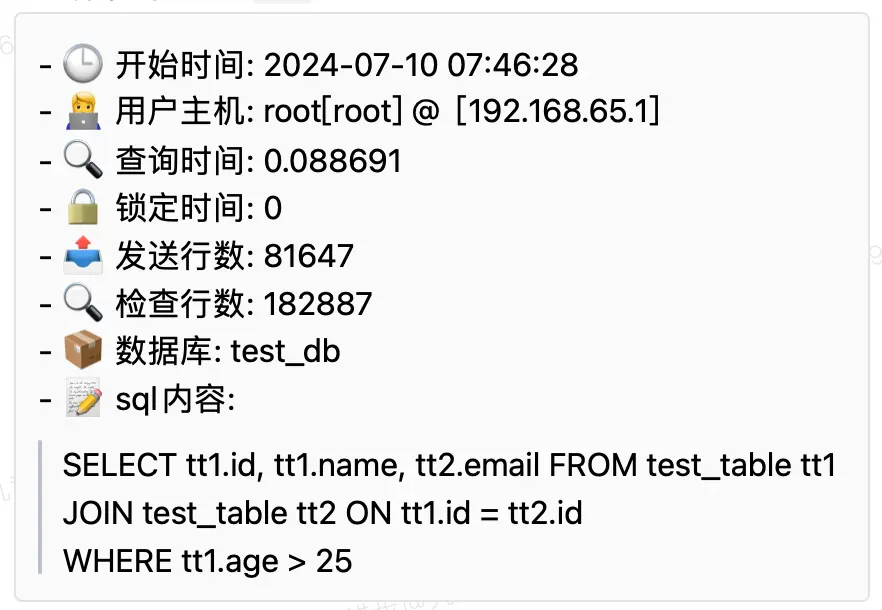
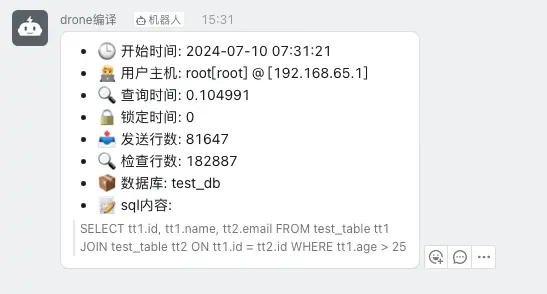
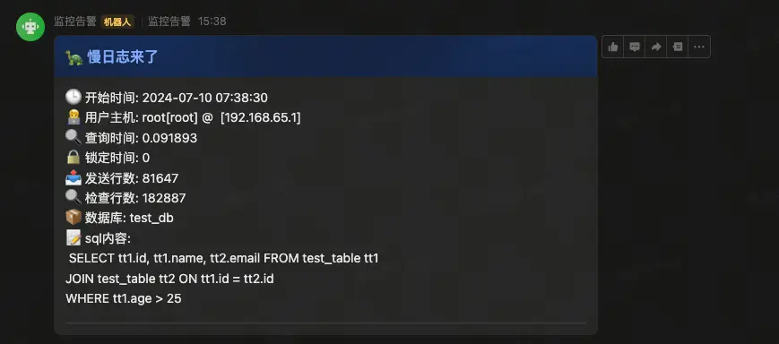

### 简介

myturtle 是一个发送mysql慢查询日志到各个IM的工具

### 项目由来

业务库中的慢查询很多，但是很多时候我们都不会去看，导致出问题有时候要去排查很久，所以我就想到了这个工具，可以将慢查询日志发送到IM，这样就可以及时的发现问题，顺便可以让开发有点事情做不会太闲。

### 为什么叫这个名字

因为你的mysql慢的和乌龟一样，所以就叫myturtle

### 效果
wechat 

dingding

feishu


### 目前支持的IM

- 飞书
- 钉钉
- 企业微信

### 使用

首先配置mysql

```ini
slow_query_log = 1 # 开启慢查询日志
slow_query_log_file = /var/lib/mysql/mysql.slow # 慢查询日志文件
long_query_time = 1 # 慢查询阈值
log_output = TABLE # 将慢查询日志写入到表中
```

之后创建mysql用户

```sql
CREATE USER `myturtle`@`%` IDENTIFIED BY 'passwd';
GRANT Select ON `mysql`.* TO `myturtle`@`%`;
```

如果是docker直接使用项目中的docker-compose.yml文件

如果是k8s直接使用项目中的deployment.yaml文件

最主要就是修改里面的环境变量

首先配置你要发送的IM的机器人

- `CHANNEL`: 支持下面几个参数 wechat,dingding,feishu

如果是wechat

- `WECHAT_BASE_URL`: 企业微信机器人的url

如果是dingding

- `DING_SECRET`: 钉钉机器人的secret
- `DINGDING_BASE_URL`: 钉钉机器人的url

如果是feishu

- `FEISHU_BOT_URL`: 飞书机器人的url
- `FEISHU_SIGN`: 飞书机器人的签名

之后配置要监控的数据库

- `DB_HOST`: mysql的地址
- `DB_PASSWORD`: mysql的密码
- `DB_USER`: mysql的用户名
- `DB_PORT`: mysql的端口

之后配置慢查询的阈值

- `QUERY_TIME`: 慢查询的阈值，就是超过多少时间就是慢查询，一般和mysql的long_query_time一致，但是为了避免消息发送过多，可以设置的大一点比如10
- `TIME_RANGE`: 查询的时间范围，程序会定时查询这个时间范围内的慢查询，单位是秒，推荐60，这样可以保证每分钟查询一次上60秒的慢查询

### 注意

如果你是运维，且在公司中地位比较低，不推荐使用此工具，因为你可能会被开发骂的很惨

## 许可证

这个项目使用 MIT 许可证，详情请见 [LICENSE](LICENSE) 文件。